# Skylark Architecture

## Current Implementation State

```mermaid
graph TB
    subgraph CLI["CLI Layer"]
        cmd["cmd/skylark/main.go ✓"]
        cmd --> init["init command ✓"]
        cmd --> watch["watch command ✗"]
        cmd --> run["run command ✓"]
        cmd --> version["version command ✓"]
        
        style init fill:#90EE90
        style watch fill:#FFB6C1
        style run fill:#90EE90
        style version fill:#90EE90
    end

    subgraph Core["Core Infrastructure"]
        watcher["File Watcher ✓<br/>(pkg/watcher)"]
        queue["Job Queue ✓<br/>(pkg/worker)"]
        pool["Worker Pool ✓<br/>(pkg/worker)"]
        processor["Command Processor ✓<br/>(pkg/processor)"]
        
        watcher -->|connected| queue
        queue -->|connected| pool
        pool -->|connected| processor
        
        style watcher fill:#90EE90
        style queue fill:#90EE90
        style pool fill:#90EE90
        style processor fill:#90EE90
    end

    subgraph Processing["Command Processing"]
        parser["Command Parser ✓<br/>(pkg/parser)"]
        assistant["Assistant Manager ✓<br/>(pkg/assistant)"]
        tools["Tool Manager ✓<br/>(pkg/tool)"]
        providers["Provider System ✓<br/>(pkg/provider)"]
        context["Context System ✓<br/>(pkg/context)"]
        sandbox["Sandbox System ✓<br/>(pkg/sandbox)"]
        
        processor -->|connected| parser
        processor -->|connected| assistant
        assistant -->|uses| context
        assistant -->|uses| tools
        assistant -->|uses| providers
        parser -->|references| context
        tools -->|executes in| sandbox
        
        subgraph Providers["Model Providers"]
            openai["OpenAI ✓<br/>(pkg/provider/openai)"]
            providers -->|implements| openai
        end
        
        style parser fill:#90EE90
        style assistant fill:#90EE90
        style tools fill:#90EE90
        style providers fill:#90EE90
        style openai fill:#90EE90
    end

    subgraph Infrastructure["Infrastructure"]
        configMgr["Config Manager ✓<br/>(pkg/config)"]
        security["Security Manager ✓<br/>(pkg/security)"]
        audit["Audit Log ✓<br/>(pkg/security/audit)"]
        errors["Error System ✓<br/>(pkg/errors)"]
        logging["Logging System ✓<br/>(pkg/logging)"]
        
        configMgr -->|load| dotSkai[".skai directory"]
        security -->|validate| configMgr
        security -->|log| audit
        errors -->|used by| Core
        errors -->|used by| Processing
        logging -->|used by| Core
        logging -->|used by| Processing
        
        style configMgr fill:#90EE90
        style security fill:#90EE90
        style audit fill:#90EE90
    end

    subgraph FileSystem["Project Structure"]
        markdown["Markdown Files"]
        dotSkai -->|assistants| assistants["Assistant Definitions"]
        dotSkai -->|tools| toolDefs["Tool Definitions"]
        dotSkai -->|config| configFile["config.yaml"]
    end

    classDef implemented fill:#90EE90,stroke:#333,stroke-width:2px;
    classDef partial fill:#FFE4B5,stroke:#333,stroke-width:2px;
    classDef missing fill:#FFB6C1,stroke:#333,stroke-width:2px;
```

Legend:
- 🟩 Green (✓): Fully implemented
- 🟨 Yellow (~): Partially implemented
- 🟥 Red (✗): Not implemented

## Implementation Details

### Implemented Components (✓)
1. **CLI Base** (pkg/cmd)
   - Entry point and command routing
   - Init command with project scaffolding
   - Run command with worker pool
   - Version command
2. **File Watcher** (pkg/watcher)
   - FSNotify integration
   - Debouncing system
   - Event filtering
3. **Worker System** (pkg/worker)
   - Job queue
   - Worker pool
   - Resource limits
4. **Command Parser** (pkg/parser)
   - Command extraction
   - Assistant resolution
   - Reference detection
5. **Context System** (pkg/context)
   - Reference parsing
   - Context assembly
   - Content truncation
   - Header relationships
6. **Tool Manager** (pkg/tool)
   - Tool compilation
   - Schema validation
   - Tool execution
7. **Sandbox System** (pkg/sandbox)
   - Resource limits
   - Network policies
   - Environment isolation
   - Result caching
8. **Config System** (pkg/config)
   - YAML parsing
   - Environment resolution
   - Validation
9. **Security** (pkg/security)
   - Audit logging
   - Access control
   - Resource limits
10. **Error System** (pkg/errors)
    - Error types and categories
    - Stack trace capture
    - Error aggregation
    - Panic recovery
11. **Logging System** (pkg/logging)
    - Structured logging
    - Log levels
    - Source tracking
    - Output formatting
12. **Command Processor** (pkg/processor)
    - Command parsing
    - Response formatting
    - Worker pool integration
13. **Assistant Manager** (pkg/assistant)
    - Assistant loading
    - Command routing
    - Tool integration
    - Context management
14. **Provider System** (pkg/provider)
    - Provider interface
    - Response types
    - OpenAI integration
    - Rate limiting

### Missing Components (✗)
1. **Watch Command**
   - File watcher integration
   - Continuous processing

## Component Details

### CLI Layer

- **main.go**: Entry point, command routing
- **init**: Project initialization
- **watch**: File watching mode
- **run**: One-time processing
- **version**: Version info

### Core System

- **File Watcher**: Monitors file changes
  - Uses fsnotify
  - Debounces rapid changes
  - Filters for .md files
- **Job Queue**: Manages processing queue
  - Size: Configurable (default 1000)
  - FIFO processing
- **Worker Pool**: Handles concurrent processing
  - Size: num_cpu \* 2 (configurable)
  - Resource limits per worker
  - Job retry logic
- **Command Processor**: Core pipeline
  - Parses commands
  - Routes to assistants
  - Manages responses
  - Updates files

### Processing Pipeline

- **Command Parser**: Extracts commands
  - Command pattern: `^!(?:([a-zA-Z-]+)\s+)?(.+)$`
  - Reference detection: `#\s*([^#\n]+?)(?:\s*#|$)`
  - Assistant resolution
- **Context System**: Manages document context
  - Reference parsing: Markdown headers and sections
  - Context assembly with size limits
  - Content truncation strategies
  - Header relationship tracking (parent/siblings)
- **Assistant Manager**: Handles assistants
  - Loads assistant definitions
  - Routes commands
  - Manages context
- **Tool Manager**: Manages tools
  - Compiles tool code
  - Executes tools
  - Manages environment
- **Sandbox System**: Tool isolation
  - Resource limits (CPU, memory, files)
  - Network access control
  - Environment isolation
  - Version verification
  - Result caching

### Infrastructure

- **Config Manager**: Handles configuration
  - Loads config.yaml
  - Environment resolution
  - Validation
- **Security Manager**: Security controls
  - API key management
  - Tool sandboxing
  - Access controls
- **Error System**: Error handling
  - Error categorization
  - Context capture
  - Stack traces
  - Error aggregation
- **Logging System**: Logging infrastructure
  - Structured logging with slog
  - Log levels and filtering
  - Source code tracking
  - Multiple output formats

### File System

- **Markdown Files**: User content
  - Command syntax
  - Reference system
- **.skai directory**: Project config
  - Assistant definitions
  - Tool definitions
  - Configuration

### Assistant System

- **Assistant Definitions**: In .skai/assistants
  - prompt.md
  - knowledge directory
- **Tools**: In .skai/tools
  - Go programs
  - Auto-compilation
  - Standard interface

## Data Flow

## Command Processing Flow

## File Update Process

