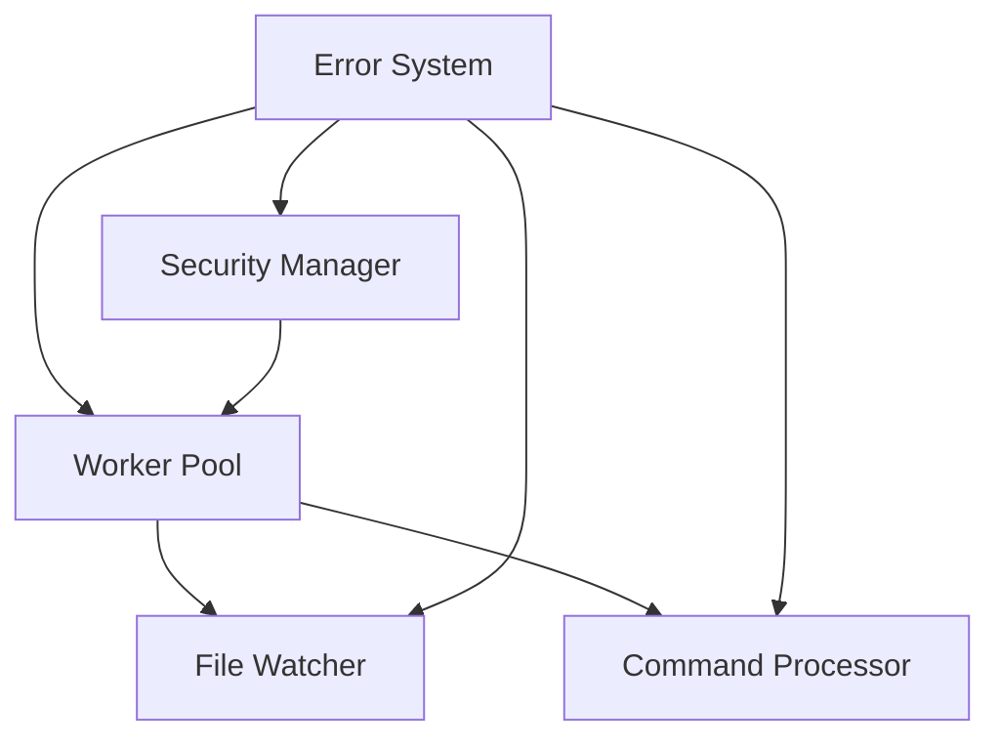

# Core Infrastructure Decoupling Implementation (✓ Completed)

> Completed on January 3, 2025 at 20:15
> - All core components abstracted
> - Interfaces and concrete implementations in place
> - Comprehensive tests added
> - Clean separation of concerns established

## Overview

This story tracks the implementation order and dependencies for decoupling core infrastructure components.

## Implementation Order

### Phase 1: Infrastructure Layer

1. Error System (202501020557) ✓

   - Interface definitions ✓
   - Mock implementations ✓
   - Migration support ✓
     Dependencies: None
     Status: Completed
   - Implemented interfaces for error handling and validation
   - Created concrete implementations in pkg/error/concrete
   - Added comprehensive tests for each component
   - Established clean separation between interfaces and implementations

2. Security Manager (202501020558) ✓
   - Key management ✓
   - Access control ✓
   - Resource limits ✓
     Dependencies: Error System
     Status: Completed
   - Implemented interfaces for AuditLogger, KeyStore, FileGuard, ResourceGuard
   - Created concrete implementations in pkg/security/concrete
   - Added comprehensive tests for each component
   - Established clean separation between interfaces and implementations

### Phase 2: Core Infrastructure

1. Worker Pool (202501020559) ✓

   - Job queue ✓
   - Resource management ✓
   - Process control ✓
     Dependencies: Error System, Security Manager
     Status: Completed
   - Implemented interfaces for Stats, Worker, Pool
   - Created concrete implementations in pkg/worker/concrete
   - Added comprehensive tests for each component
   - Established clean separation between interfaces and implementations

2. File Watcher (202501020560) ✓

   - Event handling ✓
   - Debouncing ✓
   - Path management ✓
     Dependencies: Worker Pool, Error System
     Status: Completed
   - Implemented interfaces for EventHandler, Debouncer, PathManager, FileWatcher
   - Created concrete implementations in pkg/watcher/concrete
   - Added comprehensive tests for each component
   - Established clean separation between interfaces and implementations

3. Command Processor (202501020555) ✓
   - Tool management ✓
   - Assistant routing ✓
   - Response handling ✓
     Dependencies: Worker Pool, Error System
     Status: Completed
   - Implemented interfaces for CommandProcessor, FileProcessor, ResponseHandler
   - Created concrete implementations in pkg/processor/concrete
   - Added comprehensive tests for each component
   - Established clean separation between interfaces and implementations

## Story Dependencies

## Implementation Steps

### Error System

1. Define interfaces
2. Create mock implementations
3. Update error handling
4. Add migration support

### Security Manager ✓

1. Define interfaces ✓
   - Created EventFilter, EventStorage, AuditLogger interfaces
   - Created KeyStore interface for key management
   - Created FileGuard interface for access control
   - Created ResourceGuard interface for usage limits
   - Created Manager interface for coordination
2. Create concrete implementations ✓
   - Implemented AuditLogger in concrete/audit_logger.go
   - Implemented FileGuard in concrete/file_guard.go
   - Implemented KeyStore in concrete/key_store.go
3. Update security checks ✓
   - Added file access validation
   - Added key management
   - Added audit logging
4. Add resource limits ✓
   - Implemented file size limits
   - Added path restrictions
   - Added symlink controls

### Worker Pool ✓

1. Define interfaces ✓
   - Created Stats interface for metrics
   - Created Worker interface for job processing
   - Created Pool interface for coordination
   - Created Factory interface for pool creation
2. Create concrete implementations ✓
   - Implemented poolImpl in concrete/pool.go
   - Implemented workerImpl for job processing
   - Implemented poolStats for metrics
   - Added resource limits management
3. Update job handling ✓
   - Added job queue management
   - Added process control
   - Added error handling
4. Add resource management ✓
   - Implemented CPU limits
   - Added memory limits
   - Added file limits
   - Added process limits

### File Watcher ✓

1. Define interfaces ✓
   - Created EventHandler interface for event processing
   - Created Debouncer interface for event coalescing
   - Created PathManager interface for path tracking
   - Created FileWatcher interface for coordination
   - Created Factory interface for watcher creation
2. Create concrete implementations ✓
   - Implemented watcherImpl in concrete/watcher.go
   - Implemented debouncerImpl in concrete/debouncer.go
   - Added proper error handling
   - Added event validation
3. Update event handling ✓
   - Added file change detection
   - Added job queue integration
   - Added debouncing support
4. Add path management ✓
   - Added path validation
   - Added watch path tracking
   - Added file extension filtering

### Command Processor

1. Define interfaces
2. Create mock implementations
3. Update tool handling
4. Add response management

## Testing Strategy

### Unit Tests

- Test each interface implementation
- Test mock implementations
- Test error handling
- Test resource limits

### Integration Tests

- Test component interactions
- Test error propagation
- Test resource management
- Test job processing

### Migration Tests

- Test backward compatibility
- Test error handling
- Test resource limits
- Test job processing

## Success Criteria

### Technical

- All interfaces defined
- Mock implementations working
- Tests passing
- No direct coupling

### Usability

- Clear documentation
- Simple testing
- Easy mocking
- Flexible configuration

### Migration

- Existing code works
- Clear upgrade path
- No breaking changes
- Good examples

## References

1. Stories:

   - [202501020557](202501020557-implement-error-abstraction.md) ✓
   - [202501020558](202501020558-implement-security-abstraction.md) ✓
   - [202501020559](202501020559-implement-worker-abstraction.md) ✓
   - [202501020560](202501020560-implement-watcher-abstraction.md) ✓
   - [202501020555](202501020555-refactor-processor-coupling.md) ✓

2. Analysis:

   - [202501020556](202501020556-analyze-core-coupling.md)
   - [202501020548](202501020548-story-identify-coupling-patterns.md)
   - [202501020546](202501020546-story-improve-testability.md)

3. Documentation:
   - [Architecture](../architecture.md)
   - [Implementation Plan](implementation-plan.md)
   - [Dev Log](../dev_log.md)
