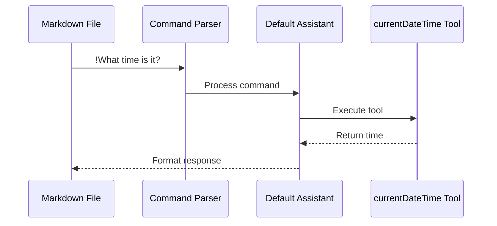

# Integrate CurrentDateTime as Builtin Tool (✓ Completed)

> Completed on January 5, 2025 at 17:55
> - Created currentdatetime tool with custom format support
> - Embedded tool source in binary using Go's embed package
> - Removed summarize tool references
> - All tests passing

Replace the existing "summarize" tool with a new "CurrentDateTime" tool by embedding it within the Skylark binary using Go's embed package. The tool follows Skai's standard tool structure and communication protocol, providing immediate value to users while serving as an example of "Assistant's w/ Tools" functionality.

## Implementation Details

### 1. Create Tool Source
```go
// internal/builtins/tools/currentdatetime/main.go
package main

import (
    "encoding/json"
    "flag"
    "fmt"
    "io"
    "os"
    "time"
)

// Input represents the tool's input format
type Input struct {
    Format string `json:"format,omitempty"` // Optional format string
}

// Output represents the tool's output format
type Output struct {
    DateTime string `json:"datetime"` // RFC3339 formatted time
}

func main() {
    usage := flag.Bool("usage", false, "Display usage schema")
    health := flag.Bool("health", false, "Check tool health")
    flag.Parse()

    if *usage {
        schema := map[string]interface{}{
            "schema": map[string]interface{}{
                "name": "currentDateTime",
                "description": "Returns current date and time in RFC3339 format",
                "parameters": map[string]interface{}{
                    "type": "object",
                    "properties": map[string]interface{}{
                        "format": map[string]interface{}{
                            "type": "string",
                            "description": "Optional time format string (defaults to RFC3339)",
                        },
                    },
                    "additionalProperties": false,
                },
            },
            "env": map[string]interface{}{},
        }
        json.NewEncoder(os.Stdout).Encode(schema)
        return
    }

    if *health {
        health := map[string]string{
            "status": "ok",
        }
        json.NewEncoder(os.Stdout).Encode(health)
        return
    }

    // Read input
    input, err := io.ReadAll(os.Stdin)
    if err != nil {
        fmt.Fprintf(os.Stderr, "Failed to read input: %v\n", err)
        os.Exit(1)
    }

    // Parse input
    var params Input
    if len(input) > 0 {
        if err := json.Unmarshal(input, &params); err != nil {
            fmt.Fprintf(os.Stderr, "Invalid input format: %v\n", err)
            os.Exit(1)
        }
    }

    // Get current time
    now := time.Now()
    format := time.RFC3339
    if params.Format != "" {
        format = params.Format
    }

    // Format output
    output := Output{
        DateTime: now.Format(format),
    }

    // Write JSON response
    if err := json.NewEncoder(os.Stdout).Encode(output); err != nil {
        fmt.Fprintf(os.Stderr, "Failed to encode output: %v\n", err)
        os.Exit(1)
    }
}
```

### 2. Embed Tool Source
```go
// internal/builtins/tools.go
package builtins

import "embed"

//go:embed tools/currentdatetime/main.go
var Tools embed.FS

// GetToolSource returns the source code for a builtin tool
func GetToolSource(name string) ([]byte, error) {
    return Tools.ReadFile(fmt.Sprintf("tools/%s/main.go", name))
}
```

### 3. Create Tool Manager

```go
// pkg/tool/manager.go
package tool

import (
    "fmt"
    "os"
    "os/exec"
    "path/filepath"
    "sync"

    "github.com/butter-bot-machines/skylark/internal/builtins"
    "github.com/fsnotify/fsnotify"
)

type Manager struct {
    tools    map[string]*Tool
    basePath string
    watcher  *fsnotify.Watcher
    mu       sync.RWMutex
}

// NewManager creates a new tool manager
func NewManager(basePath string) (*Manager, error) {
    watcher, err := fsnotify.NewWatcher()
    if err != nil {
        return nil, fmt.Errorf("failed to create watcher: %w", err)
    }

    m := &Manager{
        tools:    make(map[string]*Tool),
        basePath: basePath,
        watcher:  watcher,
    }

    // Start watching for tool changes
    go m.watchTools()

    return m, nil
}

// InitBuiltinTools extracts and initializes builtin tools
func (m *Manager) InitBuiltinTools() error {
    // Extract currentDateTime source to .skai/tools
    data, err := builtins.GetToolSource("currentdatetime")
    if err != nil {
        return fmt.Errorf("failed to read embedded source: %w", err)
    }

    // Extract to .skai/tools like any other tool
    toolDir := filepath.Join(m.basePath, "currentDateTime")
    if err := os.MkdirAll(toolDir, 0755); err != nil {
        return fmt.Errorf("failed to create tool directory: %w", err)
    }

    mainFile := filepath.Join(toolDir, "main.go")
    if err := os.WriteFile(mainFile, data, 0644); err != nil {
        return fmt.Errorf("failed to write source: %w", err)
    }

    // Let the standard tool manager handle the rest 
    // Initial compilation
    if err := m.Compile("currentDateTime"); err != nil {
        return fmt.Errorf("failed to compile tool: %w", err)
    }
    
    if err := m.watcher.Add(toolDir); err != nil {
        return fmt.Errorf("failed to watch tool directory: %w", err)
    }

    return nil
}

// watchTools monitors tool source files for changes
func (m *Manager) watchTools() {
    for {
        select {
        case event, ok := <-m.watcher.Events:
            if !ok {
                return
            }
            // Only handle .go file changes
            if filepath.Ext(event.Name) != ".go" {
                continue
            }
            // Get tool name from path
            toolName := filepath.Base(filepath.Dir(event.Name))
            // Recompile tool
            if err := m.Compile(toolName); err != nil {
                fmt.Fprintf(os.Stderr, "Failed to compile tool %s: %v\n", toolName, err)
            }
        case err, ok := <-m.watcher.Errors:
            if !ok {
                return
            }
            fmt.Fprintf(os.Stderr, "Watcher error: %v\n", err)
        }
    }
}

// Compile compiles a tool's source code
func (m *Manager) Compile(name string) error {
    toolPath := filepath.Join(m.basePath, name)
    mainFile := filepath.Join(toolPath, "main.go")
    binaryPath := filepath.Join(toolPath, name)

    cmd := exec.Command("go", "build", "-o", binaryPath, mainFile)
    cmd.Dir = toolPath

    if output, err := cmd.CombinedOutput(); err != nil {
        return fmt.Errorf("compilation failed: %s: %w", output, err)
    }

    m.mu.Lock()
    if tool, exists := m.tools[name]; exists {
        tool.LastBuilt = time.Now()
    }
    m.mu.Unlock()

    return nil
}

// Close stops the tool manager and cleans up resources
func (m *Manager) Close() error {
    return m.watcher.Close()
}
```

### 4. Update Default Assistant
```markdown
// .skai/assistants/default/prompt.md
---
name: default
description: Default assistant for general tasks
model: gpt-4o
tools:
  - name: currentDateTime
    description: Get the current date and time in various formats
---
You are a helpful assistant that provides accurate and concise information.

When processing commands, you should:
1. Understand the user's request thoroughly
2. Consider any provided context
3. Use available tools when appropriate
4. Provide clear, well-structured responses
```

### 5. Update CLI Initialization

```go
// pkg/cmd/cmd.go
func (c *CLI) Init(args []string) error {
    // ... existing directory creation ...

    // Initialize default config.yaml
    configContent := `version: "1.0"

models:
  openai:
    gpt-4:
      api_key: "${OPENAI_API_KEY}"
      temperature: 0.7
      max_tokens: 2000
      top_p: 0.9

tools:
  currentDateTime: {}  # No env vars needed

environment:
  logs:
    level: "info"
    file: "skylark.log"

  file_watch:
    debounce_delay: "500ms"
    max_delay: "2s"
    globs:
      - "./**/*.md"

  workers:
    count: 4
    queue_size: 100
`
    // ... rest of initialization ...

    // Initialize tool manager and extract builtin tools
    toolManager, err := tool.NewManager(filepath.Join(skaiDir, "tools"))
    if err != nil {
        return fmt.Errorf("failed to create tool manager: %w", err)
    }
    defer toolManager.Close()

    if err := toolManager.InitBuiltinTools(); err != nil {
        return fmt.Errorf("failed to initialize builtin tools: %w", err)
    }

    return nil
}
```

### 6. Remove Summarize Tool

1. Delete internal/tools/summarize/
2. Remove summarize references from:
   - External Documentation (keep in historical stories, but remove everywhere else)
   - Example configurations
   - Test fixtures


## Architecture Integration

1. Tool Manager Integration
   - Tool source embedded in internal/builtins
   - Extracted to .skai/tools during initialization
   - Compiled and managed like any other tool
   - Executed in sandbox with resource limits

2. Assistant Integration
   - Default assistant configured with tool
   - Commands processed through standard flow:
     1. Parse command (e.g., "!What time is it?")
     2. Route to default assistant
     3. Assistant invokes currentDateTime tool
     4. Format response and update file

3. Command Processing Flow


## Test Coverage

The test strategy focuses on real behavior and integration points:

### 1. Unit Tests
- Test tool compilation and extraction
- Verify JSON input/output handling
- Test format customization
- Ensure proper error handling

### 2. Integration Tests
- Test full lifecycle from source to binary
- Verify file watcher triggers compilation
- Test assistant integration with real tool execution
- Validate sandbox constraints

### 3. Test Assumptions
- Tool source is extracted to .skai/tools
- Tool is compiled like any other tool
- Tool follows stdin/stdout JSON protocol
- Assistant can invoke tool through standard interface

## Verification Steps

1. Project Initialization

   - Source is extracted to .skai/tools/currentDateTime/ following standard structure
   - Tool is compiled automatically by Tool file watcher
   - Tool is available in config.yaml
   - Default assistant is configured with tool

2. Tool Functionality

   - Tool follows stdin/stdout JSON protocol
   - Tool returns properly formatted JSON
   - Health checks pass
   - Schema validation works
   - Custom formats are supported
   - No environment variables needed

3. Integration

   - Tool works with assistant commands
   - JSON input/output is handled correctly
   - Sandbox constraints are respected
   - Proper error handling
   - Performance impact is minimal

4. File Watching
   - Source changes in `.skai/tools/**` trigger recompilation
   - Binary updates correctly while maintaining old binary until successful build
   - Compilation errors are properly logged
   - Tool remains available during compilation
   - Errors are properly logged

## Migration Notes

1. Breaking Changes:

   - Removal of summarize tool
   - Projects using summarize need updates
   - No direct replacement for summarization

2. Benefits:
   - Builtin tool available immediately
   - No external dependencies
   - Simple example for tool development
   - Version consistency
   - Proper JSON handling

## Follow-up Work

1. Documentation:

   - Update tool documentation
   - Add migration guide
   - Document embedded tool pattern
   - Document JSON input/output format

2. Future Improvements:
   - Add more builtin tools
   - Support tool versioning
   - Add tool dependencies
   - Add compilation caching
   - Improve error handling for compilation failures
   - Support more time formats and timezones

## Example Usage

**Before Execution**
```markdown
!What time is it?

!Show me the date in YYYY-MM-DD format
```

**After Execution (by 'default' assistant w/ AI)**
```markdown
-!What time is it?
10:57 am

-!Show me the date in YYYY-MM-DD format
2025-01-05
```
